| . | . | . | . | . |
| --- | --- | --- | --- | --- |
| [e002 point line ](https://github.com/hamoid/Fun-Programming/blob/master/processing/fun-programming/01/e002_point_line/) | [e003 random draw background ](https://github.com/hamoid/Fun-Programming/blob/master/processing/fun-programming/01/e003_random_draw_background/) | [e004 save open setup framerate ](https://github.com/hamoid/Fun-Programming/blob/master/processing/fun-programming/01/e004_save_open_setup_framerate/) | [e005 stroke rgb 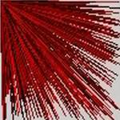](https://github.com/hamoid/Fun-Programming/blob/master/processing/fun-programming/01/e005_stroke_rgb/) | [e006 animate line 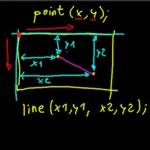](https://github.com/hamoid/Fun-Programming/blob/master/processing/fun-programming/01/e006_animate_line/)  |
| [e007 variables ](https://github.com/hamoid/Fun-Programming/blob/master/processing/fun-programming/01/e007_variables/) | [e008 vertical lines ](https://github.com/hamoid/Fun-Programming/blob/master/processing/fun-programming/01/e008_vertical_lines/) | [e009 vertical colorful ](https://github.com/hamoid/Fun-Programming/blob/master/processing/fun-programming/01/e009_vertical_colorful/) | [e010 rectmode rect circle 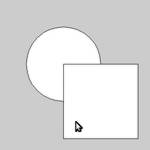](https://github.com/hamoid/Fun-Programming/blob/master/processing/fun-programming/01/e010_rectmode_rect_circle/) | [e011 linear motion 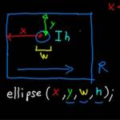](https://github.com/hamoid/Fun-Programming/blob/master/processing/fun-programming/01/e011_linear_motion/)  |
| [e012 loop if 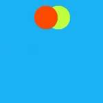](https://github.com/hamoid/Fun-Programming/blob/master/processing/fun-programming/01/e012_loop_if/) | [e013 random event ](https://github.com/hamoid/Fun-Programming/blob/master/processing/fun-programming/01/e013_random_event/) | [e014 directions 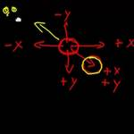](https://github.com/hamoid/Fun-Programming/blob/master/processing/fun-programming/01/e014_directions/) | [e015 bouncing ball 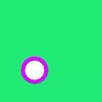](https://github.com/hamoid/Fun-Programming/blob/master/processing/fun-programming/01/e015_bouncing_ball/) | [e016 rgb rainbow 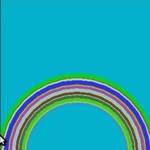](https://github.com/hamoid/Fun-Programming/blob/master/processing/fun-programming/01/e016_rgb_rainbow/)  |
| [e017 hsb rainbow ](https://github.com/hamoid/Fun-Programming/blob/master/processing/fun-programming/01/e017_hsb_rainbow/) | [e018 probability 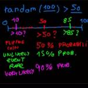](https://github.com/hamoid/Fun-Programming/blob/master/processing/fun-programming/01/e018_probability/) | [e019 function 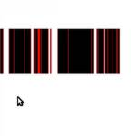](https://github.com/hamoid/Fun-Programming/blob/master/processing/fun-programming/01/e019_function/) | [e020 key press save img ](https://github.com/hamoid/Fun-Programming/blob/master/processing/fun-programming/01/e020_key_press_save_img/) | [e021 key shortcuts ](https://github.com/hamoid/Fun-Programming/blob/master/processing/fun-programming/01/e021_key_shortcuts/)  |
| [e022 fade out stars ](https://github.com/hamoid/Fun-Programming/blob/master/processing/fun-programming/01/e022_fade_out_stars/) | [e023 while loop ](https://github.com/hamoid/Fun-Programming/blob/master/processing/fun-programming/01/e023_while_loop/) | [e024 circle patterns 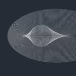](https://github.com/hamoid/Fun-Programming/blob/master/processing/fun-programming/01/e024_circle_patterns/) | [e025 type letters ](https://github.com/hamoid/Fun-Programming/blob/master/processing/fun-programming/01/e025_type_letters/) | [e026 rotation 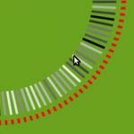](https://github.com/hamoid/Fun-Programming/blob/master/processing/fun-programming/02/e026_rotation/)  |
| [e027 rotate spiral 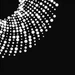](https://github.com/hamoid/Fun-Programming/blob/master/processing/fun-programming/02/e027_rotate_spiral/) | [e028 translate spiral ](https://github.com/hamoid/Fun-Programming/blob/master/processing/fun-programming/02/e028_translate_spiral/) | [e029 rectangocopter ](https://github.com/hamoid/Fun-Programming/blob/master/processing/fun-programming/02/e029_rectangocopter/) | [e030 reset Matrix ](https://github.com/hamoid/Fun-Programming/blob/master/processing/fun-programming/02/e030_resetMatrix/) | [e031 function types ](https://github.com/hamoid/Fun-Programming/blob/master/processing/fun-programming/02/e031_function_types/)  |
| [e032 functions with parameters ](https://github.com/hamoid/Fun-Programming/blob/master/processing/fun-programming/02/e032_functions_with_parameters/) | [e033 diff rot speed ](https://github.com/hamoid/Fun-Programming/blob/master/processing/fun-programming/02/e033_diff_rot_speed/) | [e033 scaling ](https://github.com/hamoid/Fun-Programming/blob/master/processing/fun-programming/02/e033_scaling/) | [e034 grid ](https://github.com/hamoid/Fun-Programming/blob/master/processing/fun-programming/02/e034_grid/) | [e035 rotating grid ](https://github.com/hamoid/Fun-Programming/blob/master/processing/fun-programming/02/e035_rotating_grid/)  |
| [e036 noise ](https://github.com/hamoid/Fun-Programming/blob/master/processing/fun-programming/02/e036_noise/) | [e037 dancing rect ](https://github.com/hamoid/Fun-Programming/blob/master/processing/fun-programming/02/e037_dancing_rect/) | [e038 xyz noise ](https://github.com/hamoid/Fun-Programming/blob/master/processing/fun-programming/02/e038_xyz_noise/) | [e039 candy space 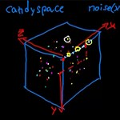](https://github.com/hamoid/Fun-Programming/blob/master/processing/fun-programming/02/e039_candy_space/) | [e040 candy space 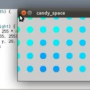](https://github.com/hamoid/Fun-Programming/blob/master/processing/fun-programming/02/e040_candy_space/)  |
| [e041 sine wave ](https://github.com/hamoid/Fun-Programming/blob/master/processing/fun-programming/02/e041_sine_wave/) | [e042 android 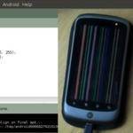](https://github.com/hamoid/Fun-Programming/blob/master/processing/fun-programming/02/e042_android/) | [e043 map sine 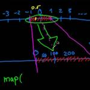](https://github.com/hamoid/Fun-Programming/blob/master/processing/fun-programming/02/e043_map_sine/) | [e044 combine sine ](https://github.com/hamoid/Fun-Programming/blob/master/processing/fun-programming/02/e044_combine_sine/) | [e045 map color sz ](https://github.com/hamoid/Fun-Programming/blob/master/processing/fun-programming/02/e045_map_color_sz/)  |
| [e046 sin xy ](https://github.com/hamoid/Fun-Programming/blob/master/processing/fun-programming/02/e046_sin_xy/) | [e047 zoom in ](https://github.com/hamoid/Fun-Programming/blob/master/processing/fun-programming/02/e047_zoom_in/) | [e048 load image ](https://github.com/hamoid/Fun-Programming/blob/master/processing/fun-programming/02/e048_load_image/) | [e049 copy image 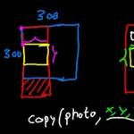](https://github.com/hamoid/Fun-Programming/blob/master/processing/fun-programming/02/e049_copy_image/) | [e050 scope ](https://github.com/hamoid/Fun-Programming/blob/master/processing/fun-programming/02/e050_scope/)  |
| [e051 copy image 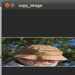](https://github.com/hamoid/Fun-Programming/blob/master/processing/fun-programming/03/e051_copy_image/) | [e052 drunk camera man 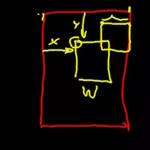](https://github.com/hamoid/Fun-Programming/blob/master/processing/fun-programming/03/e052_drunk_camera_man/) | [e053 texture 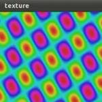](https://github.com/hamoid/Fun-Programming/blob/master/processing/fun-programming/03/e053_texture/) | [e054 array 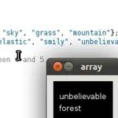](https://github.com/hamoid/Fun-Programming/blob/master/processing/fun-programming/03/e054_array/) | [e055 array length ](https://github.com/hamoid/Fun-Programming/blob/master/processing/fun-programming/03/e055_array_length/)  |
| [e056 sentence ](https://github.com/hamoid/Fun-Programming/blob/master/processing/fun-programming/03/e056_sentence/) | [e057 silly poet ](https://github.com/hamoid/Fun-Programming/blob/master/processing/fun-programming/03/e057_silly_poet/) | [e058 star field ](https://github.com/hamoid/Fun-Programming/blob/master/processing/fun-programming/03/e058_star_field/) | [e059 star field ](https://github.com/hamoid/Fun-Programming/blob/master/processing/fun-programming/03/e059_star_field/) | [e060 distance ](https://github.com/hamoid/Fun-Programming/blob/master/processing/fun-programming/03/e060_distance/)  |
| [e061 append to array 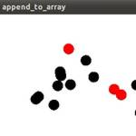](https://github.com/hamoid/Fun-Programming/blob/master/processing/fun-programming/03/e061_append_to_array/) | [e062 bouncing rects 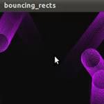](https://github.com/hamoid/Fun-Programming/blob/master/processing/fun-programming/03/e062_bouncing_rects/) | [e063 three d 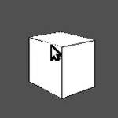](https://github.com/hamoid/Fun-Programming/blob/master/processing/fun-programming/03/e063_three_d/) | [e064 lerp 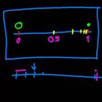](https://github.com/hamoid/Fun-Programming/blob/master/processing/fun-programming/03/e064_lerp/) | [e065 dist 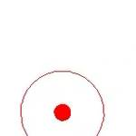](https://github.com/hamoid/Fun-Programming/blob/master/processing/fun-programming/03/e065_dist/)  |
| [e066 how random ](https://github.com/hamoid/Fun-Programming/blob/master/processing/fun-programming/03/e066_how_random/) | [e067 sinecosine 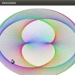](https://github.com/hamoid/Fun-Programming/blob/master/processing/fun-programming/03/e067_sinecosine/) | [e068 circular motion 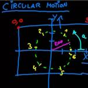](https://github.com/hamoid/Fun-Programming/blob/master/processing/fun-programming/03/e068_circular_motion/) | [e069 adding motion ](https://github.com/hamoid/Fun-Programming/blob/master/processing/fun-programming/03/e069_adding_motion/) | [e070 direction ](https://github.com/hamoid/Fun-Programming/blob/master/processing/fun-programming/03/e070_direction/)  |
| [e071 direction2 ](https://github.com/hamoid/Fun-Programming/blob/master/processing/fun-programming/03/e071_direction2/) | [e072 modulo 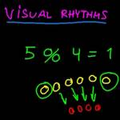](https://github.com/hamoid/Fun-Programming/blob/master/processing/fun-programming/03/e072_modulo/) | [e073 circle beat ](https://github.com/hamoid/Fun-Programming/blob/master/processing/fun-programming/03/e073_circle_beat/) | [e074 shortcuts ](https://github.com/hamoid/Fun-Programming/blob/master/processing/fun-programming/03/e074_shortcuts/) | [e075 bezier 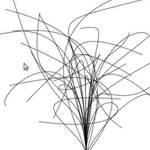](https://github.com/hamoid/Fun-Programming/blob/master/processing/fun-programming/03/e075_bezier/)  |
| [e076 anim bezier 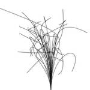](https://github.com/hamoid/Fun-Programming/blob/master/processing/fun-programming/04/e076_anim_bezier/) | [e077 three d point cloud 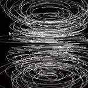](https://github.com/hamoid/Fun-Programming/blob/master/processing/fun-programming/04/e077_three_d_point_cloud/) | [e078 three d line cloud 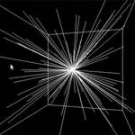](https://github.com/hamoid/Fun-Programming/blob/master/processing/fun-programming/04/e078_three_d_line_cloud/) | [e079 three d plant ](https://github.com/hamoid/Fun-Programming/blob/master/processing/fun-programming/04/e079_three_d_plant/) | [e080 read pixel colors ](https://github.com/hamoid/Fun-Programming/blob/master/processing/fun-programming/04/e080_read_pixel_colors/)  |
| [e081 read pixel colors 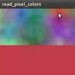](https://github.com/hamoid/Fun-Programming/blob/master/processing/fun-programming/04/e081_read_pixel_colors/) | [e082 gradient ](https://github.com/hamoid/Fun-Programming/blob/master/processing/fun-programming/04/e082_gradient/) | [e083 c gradient ](https://github.com/hamoid/Fun-Programming/blob/master/processing/fun-programming/04/e083_c_gradient/) | [e084 interactive gradient ](https://github.com/hamoid/Fun-Programming/blob/master/processing/fun-programming/04/e084_interactive_gradient/) | [e085 changing image ](https://github.com/hamoid/Fun-Programming/blob/master/processing/fun-programming/04/e085_changing_image/)  |
| [e086 changing image ](https://github.com/hamoid/Fun-Programming/blob/master/processing/fun-programming/04/e086_changing_image/) | [e087 strings 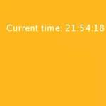](https://github.com/hamoid/Fun-Programming/blob/master/processing/fun-programming/04/e087_strings/) | [e088 pixels array 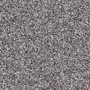](https://github.com/hamoid/Fun-Programming/blob/master/processing/fun-programming/04/e088_pixels_array/) | [e089 manipulate pixels ](https://github.com/hamoid/Fun-Programming/blob/master/processing/fun-programming/04/e089_manipulate_pixels/) | [e090 hsb pixels 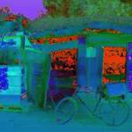](https://github.com/hamoid/Fun-Programming/blob/master/processing/fun-programming/04/e090_hsb_pixels/)  |
| [e091 timelines ](https://github.com/hamoid/Fun-Programming/blob/master/processing/fun-programming/04/e091_timelines/) | [e092 draggable ](https://github.com/hamoid/Fun-Programming/blob/master/processing/fun-programming/04/e092_draggable/) | [e093 draggable2 ](https://github.com/hamoid/Fun-Programming/blob/master/processing/fun-programming/04/e093_draggable2/) | [e094 boolean and or ](https://github.com/hamoid/Fun-Programming/blob/master/processing/fun-programming/04/e094_boolean_and_or/) | [e095 draggable rect ](https://github.com/hamoid/Fun-Programming/blob/master/processing/fun-programming/04/e095_draggable_rect/)  |
| [e096 click rect 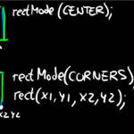](https://github.com/hamoid/Fun-Programming/blob/master/processing/fun-programming/04/e096_click_rect/) | [e097 many rectangles 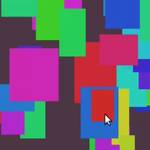](https://github.com/hamoid/Fun-Programming/blob/master/processing/fun-programming/04/e097_many_rectangles/) | [e098 mouse rectangles ](https://github.com/hamoid/Fun-Programming/blob/master/processing/fun-programming/04/e098_mouse_rectangles/) | [e099 sound ](https://github.com/hamoid/Fun-Programming/blob/master/processing/fun-programming/04/e099_sound/) | [e100 rhythm ](https://github.com/hamoid/Fun-Programming/blob/master/processing/fun-programming/04/e100_rhythm/)  |
| [e101 promidi ](https://github.com/hamoid/Fun-Programming/blob/master/processing/fun-programming/05/e101_promidi/) | [e102 osc android accel ](https://github.com/hamoid/Fun-Programming/blob/master/processing/fun-programming/05/e102_osc_android_accel/) | [e103 why functions 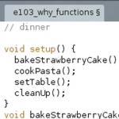](https://github.com/hamoid/Fun-Programming/blob/master/processing/fun-programming/05/e103_why_functions/) | [e104 classes and objects 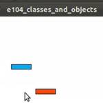](https://github.com/hamoid/Fun-Programming/blob/master/processing/fun-programming/05/e104_classes_and_objects/) | [e111 array of objects ](https://github.com/hamoid/Fun-Programming/blob/master/processing/fun-programming/05/e111_array_of_objects/)  |
| [e112 hypnotic1 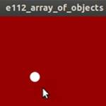](https://github.com/hamoid/Fun-Programming/blob/master/processing/fun-programming/05/e112_hypnotic1/) | [e113 hypnotic2 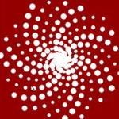](https://github.com/hamoid/Fun-Programming/blob/master/processing/fun-programming/05/e113_hypnotic2/) | [e114 render movie ](https://github.com/hamoid/Fun-Programming/blob/master/processing/fun-programming/05/e114_render_movie/) | [e116 loading bytes ](https://github.com/hamoid/Fun-Programming/blob/master/processing/fun-programming/05/e116_loading_bytes/) | [e117 loading bytes ](https://github.com/hamoid/Fun-Programming/blob/master/processing/fun-programming/05/e117_loading_bytes/)  |
| [e118 loading bytes 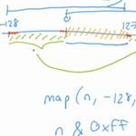](https://github.com/hamoid/Fun-Programming/blob/master/processing/fun-programming/05/e118_loading_bytes/) | [e120 read file animate 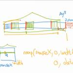](https://github.com/hamoid/Fun-Programming/blob/master/processing/fun-programming/05/e120_read_file_animate/) | [e121 webcam ](https://github.com/hamoid/Fun-Programming/blob/master/processing/fun-programming/05/e121_webcam/) | [e122 scale and rose 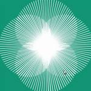](https://github.com/hamoid/Fun-Programming/blob/master/processing/fun-programming/05/e122_scale_and_rose/) | [e123 midi control changes ](https://github.com/hamoid/Fun-Programming/blob/master/processing/fun-programming/05/e123_midi_control_changes/)  |
| [e124 midi control change array 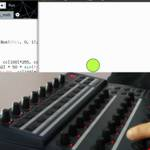](https://github.com/hamoid/Fun-Programming/blob/master/processing/fun-programming/05/e124_midi_control_change_array/) | [e125 basic video player ](https://github.com/hamoid/Fun-Programming/blob/master/processing/fun-programming/05/e125_basic_video_player/) | [e126 abstract movie player ](https://github.com/hamoid/Fun-Programming/blob/master/processing/fun-programming/06/e126_abstract_movie_player/) | [e127 fun with filters ](https://github.com/hamoid/Fun-Programming/blob/master/processing/fun-programming/06/e127_fun_with_filters/) | [e128 filter animated blobs ](https://github.com/hamoid/Fun-Programming/blob/master/processing/fun-programming/06/e128_filter_animated_blobs/)  |
| [e133 Sin Osc demo ](https://github.com/hamoid/Fun-Programming/blob/master/processing/fun-programming/06/e133_SinOsc_demo/) | [e136 functions compared to supercollider ](https://github.com/hamoid/Fun-Programming/blob/master/processing/fun-programming/06/e136_functions_compared_to_supercollider/) | [e138 talk to supercollider ](https://github.com/hamoid/Fun-Programming/blob/master/processing/fun-programming/06/e138_talk_to_supercollider/) | [e139 change values of running program ](https://github.com/hamoid/Fun-Programming/blob/master/processing/fun-programming/06/e139_change_values_of_running_program/) | [e140 recursion and graphics ](https://github.com/hamoid/Fun-Programming/blob/master/processing/fun-programming/06/e140_recursion_and_graphics/)  |
| [e141 pjs audio 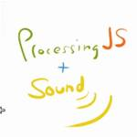](https://github.com/hamoid/Fun-Programming/blob/master/processing/fun-programming/06/e141_pjs_audio/) | [e141 pjs audio](https://github.com/hamoid/Fun-Programming/blob/master/processing/fun-programming/06/e141_pjs_audio/web-export/) | [e143 pgraphics ](https://github.com/hamoid/Fun-Programming/blob/master/processing/fun-programming/06/e143_pgraphics/) | [e144 loop drawing toy ](https://github.com/hamoid/Fun-Programming/blob/master/processing/fun-programming/06/e144_loop_drawing_toy/) | [e145 create animgif ](https://github.com/hamoid/Fun-Programming/blob/master/processing/fun-programming/06/e145_create_animgif/)  |
| [e146 errors 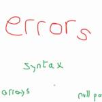](https://github.com/hamoid/Fun-Programming/blob/master/processing/fun-programming/06/e146_errors/) | [e147 glow shadow ](https://github.com/hamoid/Fun-Programming/blob/master/processing/fun-programming/06/e147_glow_shadow/) | [e148 glowing svg vector shape ](https://github.com/hamoid/Fun-Programming/blob/master/processing/fun-programming/06/e148_glowing_svg_vector_shape/) | [e150 webcam light tracking air draw ](https://github.com/hamoid/Fun-Programming/blob/master/processing/fun-programming/06/e150_webcam_light_tracking_air_draw/) | [e151 image To Cube Matrix ](https://github.com/hamoid/Fun-Programming/blob/master/processing/fun-programming/07/e151_imageToCubeMatrix/)  |
