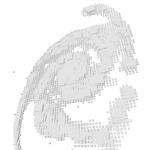

| . | . | . | . |
| --- | --- | --- | --- |
| [e002 point line](https://github.com/hamoid/Fun-Programming/blob/master/processing/01/e002_point_line/) | [e003 random draw background](https://github.com/hamoid/Fun-Programming/blob/master/processing/01/e003_random_draw_background/) | [e004 save open setup framerate](https://github.com/hamoid/Fun-Programming/blob/master/processing/01/e004_save_open_setup_framerate/) | [e005 stroke rgb](https://github.com/hamoid/Fun-Programming/blob/master/processing/01/e005_stroke_rgb/)  |
| [e006 animate line](https://github.com/hamoid/Fun-Programming/blob/master/processing/01/e006_animate_line/) | [e007 variables](https://github.com/hamoid/Fun-Programming/blob/master/processing/01/e007_variables/) | [e008 vertical lines](https://github.com/hamoid/Fun-Programming/blob/master/processing/01/e008_vertical_lines/) | [e009 vertical colorful](https://github.com/hamoid/Fun-Programming/blob/master/processing/01/e009_vertical_colorful/)  |
| [e010 rectmode rect circle](https://github.com/hamoid/Fun-Programming/blob/master/processing/01/e010_rectmode_rect_circle/) | [e011 linear motion](https://github.com/hamoid/Fun-Programming/blob/master/processing/01/e011_linear_motion/) | [e012 loop if](https://github.com/hamoid/Fun-Programming/blob/master/processing/01/e012_loop_if/) | [e013 random event](https://github.com/hamoid/Fun-Programming/blob/master/processing/01/e013_random_event/)  |
| [e014 directions](https://github.com/hamoid/Fun-Programming/blob/master/processing/01/e014_directions/) | [e015 bouncing ball](https://github.com/hamoid/Fun-Programming/blob/master/processing/01/e015_bouncing_ball/) | [e016 rgb rainbow](https://github.com/hamoid/Fun-Programming/blob/master/processing/01/e016_rgb_rainbow/) | [e017 hsb rainbow](https://github.com/hamoid/Fun-Programming/blob/master/processing/01/e017_hsb_rainbow/)  |
| [e018 probability](https://github.com/hamoid/Fun-Programming/blob/master/processing/01/e018_probability/) | [e019 function](https://github.com/hamoid/Fun-Programming/blob/master/processing/01/e019_function/) | [e020 key press save img](https://github.com/hamoid/Fun-Programming/blob/master/processing/01/e020_key_press_save_img/) | [e021 key shortcuts](https://github.com/hamoid/Fun-Programming/blob/master/processing/01/e021_key_shortcuts/)  |
| [e022 fade out stars](https://github.com/hamoid/Fun-Programming/blob/master/processing/01/e022_fade_out_stars/) | [e023 while loop](https://github.com/hamoid/Fun-Programming/blob/master/processing/01/e023_while_loop/) | [e024 circle patterns](https://github.com/hamoid/Fun-Programming/blob/master/processing/01/e024_circle_patterns/) | [e025 type letters](https://github.com/hamoid/Fun-Programming/blob/master/processing/01/e025_type_letters/)  |
| [e026 rotation](https://github.com/hamoid/Fun-Programming/blob/master/processing/02/e026_rotation/) | [e027 rotate spiral](https://github.com/hamoid/Fun-Programming/blob/master/processing/02/e027_rotate_spiral/) | [e028 translate spiral](https://github.com/hamoid/Fun-Programming/blob/master/processing/02/e028_translate_spiral/) | [e029 rectangocopter](https://github.com/hamoid/Fun-Programming/blob/master/processing/02/e029_rectangocopter/)  |
| [e030 reset Matrix](https://github.com/hamoid/Fun-Programming/blob/master/processing/02/e030_resetMatrix/) | [e031 function types](https://github.com/hamoid/Fun-Programming/blob/master/processing/02/e031_function_types/) | [e032 functions with parameters](https://github.com/hamoid/Fun-Programming/blob/master/processing/02/e032_functions_with_parameters/) | [e033 diff rot speed](https://github.com/hamoid/Fun-Programming/blob/master/processing/02/e033_diff_rot_speed/)  |
| [e033 scaling](https://github.com/hamoid/Fun-Programming/blob/master/processing/02/e033_scaling/) | [e034 grid](https://github.com/hamoid/Fun-Programming/blob/master/processing/02/e034_grid/) | [e035 rotating grid](https://github.com/hamoid/Fun-Programming/blob/master/processing/02/e035_rotating_grid/) | [e036 noise](https://github.com/hamoid/Fun-Programming/blob/master/processing/02/e036_noise/)  |
| [e037 dancing rect](https://github.com/hamoid/Fun-Programming/blob/master/processing/02/e037_dancing_rect/) | [e038 xyz noise](https://github.com/hamoid/Fun-Programming/blob/master/processing/02/e038_xyz_noise/) | [e039 candy space](https://github.com/hamoid/Fun-Programming/blob/master/processing/02/e039_candy_space/) | [e040 candy space](https://github.com/hamoid/Fun-Programming/blob/master/processing/02/e040_candy_space/)  |
| [e041 sine wave](https://github.com/hamoid/Fun-Programming/blob/master/processing/02/e041_sine_wave/) | [e042 android](https://github.com/hamoid/Fun-Programming/blob/master/processing/02/e042_android/) | [e043 map sine](https://github.com/hamoid/Fun-Programming/blob/master/processing/02/e043_map_sine/) | [e044 combine sine](https://github.com/hamoid/Fun-Programming/blob/master/processing/02/e044_combine_sine/)  |
| [e045 map color sz](https://github.com/hamoid/Fun-Programming/blob/master/processing/02/e045_map_color_sz/) | [e046 sin xy](https://github.com/hamoid/Fun-Programming/blob/master/processing/02/e046_sin_xy/) | [e047 zoom in](https://github.com/hamoid/Fun-Programming/blob/master/processing/02/e047_zoom_in/) | [e048 load image](https://github.com/hamoid/Fun-Programming/blob/master/processing/02/e048_load_image/)  |
| [e049 copy image](https://github.com/hamoid/Fun-Programming/blob/master/processing/02/e049_copy_image/) | [e050 scope](https://github.com/hamoid/Fun-Programming/blob/master/processing/02/e050_scope/) | [e051 copy image](https://github.com/hamoid/Fun-Programming/blob/master/processing/03/e051_copy_image/) | [e052 drunk camera man](https://github.com/hamoid/Fun-Programming/blob/master/processing/03/e052_drunk_camera_man/)  |
| [e053 texture](https://github.com/hamoid/Fun-Programming/blob/master/processing/03/e053_texture/) | [e054 array](https://github.com/hamoid/Fun-Programming/blob/master/processing/03/e054_array/) | [e055 array length](https://github.com/hamoid/Fun-Programming/blob/master/processing/03/e055_array_length/) | [e056 sentence](https://github.com/hamoid/Fun-Programming/blob/master/processing/03/e056_sentence/)  |
| [e057 silly poet](https://github.com/hamoid/Fun-Programming/blob/master/processing/03/e057_silly_poet/) | [e058 star field](https://github.com/hamoid/Fun-Programming/blob/master/processing/03/e058_star_field/) | [e059 star field](https://github.com/hamoid/Fun-Programming/blob/master/processing/03/e059_star_field/) | [e060 distance](https://github.com/hamoid/Fun-Programming/blob/master/processing/03/e060_distance/)  |
| [e061 append to array](https://github.com/hamoid/Fun-Programming/blob/master/processing/03/e061_append_to_array/) | [e062 bouncing rects](https://github.com/hamoid/Fun-Programming/blob/master/processing/03/e062_bouncing_rects/) | [e063 three d](https://github.com/hamoid/Fun-Programming/blob/master/processing/03/e063_three_d/) | [e064 lerp](https://github.com/hamoid/Fun-Programming/blob/master/processing/03/e064_lerp/)  |
| [e065 dist](https://github.com/hamoid/Fun-Programming/blob/master/processing/03/e065_dist/) | [e066 how random](https://github.com/hamoid/Fun-Programming/blob/master/processing/03/e066_how_random/) | [e067 sinecosine](https://github.com/hamoid/Fun-Programming/blob/master/processing/03/e067_sinecosine/) | [e068 circular motion](https://github.com/hamoid/Fun-Programming/blob/master/processing/03/e068_circular_motion/)  |
| [e069 adding motion](https://github.com/hamoid/Fun-Programming/blob/master/processing/03/e069_adding_motion/) | [e070 direction](https://github.com/hamoid/Fun-Programming/blob/master/processing/03/e070_direction/) | [e071 direction2](https://github.com/hamoid/Fun-Programming/blob/master/processing/03/e071_direction2/) | [e072 modulo](https://github.com/hamoid/Fun-Programming/blob/master/processing/03/e072_modulo/)  |
| [e073 circle beat](https://github.com/hamoid/Fun-Programming/blob/master/processing/03/e073_circle_beat/) | [e074 shortcuts](https://github.com/hamoid/Fun-Programming/blob/master/processing/03/e074_shortcuts/) | [e075 bezier](https://github.com/hamoid/Fun-Programming/blob/master/processing/03/e075_bezier/) | [e076 anim bezier](https://github.com/hamoid/Fun-Programming/blob/master/processing/04/e076_anim_bezier/)  |
| [e077 three d point cloud](https://github.com/hamoid/Fun-Programming/blob/master/processing/04/e077_three_d_point_cloud/) | [e078 three d line cloud](https://github.com/hamoid/Fun-Programming/blob/master/processing/04/e078_three_d_line_cloud/) | [e079 three d plant](https://github.com/hamoid/Fun-Programming/blob/master/processing/04/e079_three_d_plant/) | [e080 read pixel colors](https://github.com/hamoid/Fun-Programming/blob/master/processing/04/e080_read_pixel_colors/)  |
| [e081 read pixel colors](https://github.com/hamoid/Fun-Programming/blob/master/processing/04/e081_read_pixel_colors/) | [e082 gradient](https://github.com/hamoid/Fun-Programming/blob/master/processing/04/e082_gradient/) | [e083 c gradient](https://github.com/hamoid/Fun-Programming/blob/master/processing/04/e083_c_gradient/) | [e084 interactive gradient](https://github.com/hamoid/Fun-Programming/blob/master/processing/04/e084_interactive_gradient/)  |
| [e085 changing image](https://github.com/hamoid/Fun-Programming/blob/master/processing/04/e085_changing_image/) | [e086 changing image](https://github.com/hamoid/Fun-Programming/blob/master/processing/04/e086_changing_image/) | [e087 strings](https://github.com/hamoid/Fun-Programming/blob/master/processing/04/e087_strings/) | [e088 pixels array](https://github.com/hamoid/Fun-Programming/blob/master/processing/04/e088_pixels_array/)  |
| [e089 manipulate pixels](https://github.com/hamoid/Fun-Programming/blob/master/processing/04/e089_manipulate_pixels/) | [e090 hsb pixels](https://github.com/hamoid/Fun-Programming/blob/master/processing/04/e090_hsb_pixels/) | [e091 timelines](https://github.com/hamoid/Fun-Programming/blob/master/processing/04/e091_timelines/) | [e092 draggable](https://github.com/hamoid/Fun-Programming/blob/master/processing/04/e092_draggable/)  |
| [e093 draggable2](https://github.com/hamoid/Fun-Programming/blob/master/processing/04/e093_draggable2/) | [e094 boolean and or](https://github.com/hamoid/Fun-Programming/blob/master/processing/04/e094_boolean_and_or/) | [e095 draggable rect](https://github.com/hamoid/Fun-Programming/blob/master/processing/04/e095_draggable_rect/) | [e096 click rect](https://github.com/hamoid/Fun-Programming/blob/master/processing/04/e096_click_rect/)  |
| [e097 many rectangles](https://github.com/hamoid/Fun-Programming/blob/master/processing/04/e097_many_rectangles/) | [e098 mouse rectangles](https://github.com/hamoid/Fun-Programming/blob/master/processing/04/e098_mouse_rectangles/) | [e099 sound](https://github.com/hamoid/Fun-Programming/blob/master/processing/04/e099_sound/) | [e100 rhythm](https://github.com/hamoid/Fun-Programming/blob/master/processing/04/e100_rhythm/)  |
| [e101 promidi](https://github.com/hamoid/Fun-Programming/blob/master/processing/05/e101_promidi/) | [e102 osc android accel](https://github.com/hamoid/Fun-Programming/blob/master/processing/05/e102_osc_android_accel/) | [e103 why functions](https://github.com/hamoid/Fun-Programming/blob/master/processing/05/e103_why_functions/) | [e104 classes and objects](https://github.com/hamoid/Fun-Programming/blob/master/processing/05/e104_classes_and_objects/)  |
| [e111 array of objects](https://github.com/hamoid/Fun-Programming/blob/master/processing/05/e111_array_of_objects/) | [e112 hypnotic1](https://github.com/hamoid/Fun-Programming/blob/master/processing/05/e112_hypnotic1/) | [e113 hypnotic2](https://github.com/hamoid/Fun-Programming/blob/master/processing/05/e113_hypnotic2/) | [e114 render movie](https://github.com/hamoid/Fun-Programming/blob/master/processing/05/e114_render_movie/)  |
| [e116 loading bytes](https://github.com/hamoid/Fun-Programming/blob/master/processing/05/e116_loading_bytes/) | [e117 loading bytes](https://github.com/hamoid/Fun-Programming/blob/master/processing/05/e117_loading_bytes/) | [e118 loading bytes](https://github.com/hamoid/Fun-Programming/blob/master/processing/05/e118_loading_bytes/) | [e120 read file animate](https://github.com/hamoid/Fun-Programming/blob/master/processing/05/e120_read_file_animate/)  |
| [e121 webcam](https://github.com/hamoid/Fun-Programming/blob/master/processing/05/e121_webcam/) | [e122 scale and rose](https://github.com/hamoid/Fun-Programming/blob/master/processing/05/e122_scale_and_rose/) | [e123 midi control changes](https://github.com/hamoid/Fun-Programming/blob/master/processing/05/e123_midi_control_changes/) | [e124 midi control change array](https://github.com/hamoid/Fun-Programming/blob/master/processing/05/e124_midi_control_change_array/)  |
| [e125 basic video player](https://github.com/hamoid/Fun-Programming/blob/master/processing/05/e125_basic_video_player/) | [e126 abstract movie player](https://github.com/hamoid/Fun-Programming/blob/master/processing/06/e126_abstract_movie_player/) | [e127 fun with filters](https://github.com/hamoid/Fun-Programming/blob/master/processing/06/e127_fun_with_filters/) | [e128 filter animated blobs](https://github.com/hamoid/Fun-Programming/blob/master/processing/06/e128_filter_animated_blobs/)  |
| [e133 Sin Osc demo](https://github.com/hamoid/Fun-Programming/blob/master/processing/06/e133_SinOsc_demo/) | [e136 functions compared to supercollider](https://github.com/hamoid/Fun-Programming/blob/master/processing/06/e136_functions_compared_to_supercollider/) | [e138 talk to supercollider](https://github.com/hamoid/Fun-Programming/blob/master/processing/06/e138_talk_to_supercollider/) | [e139 change values of running program](https://github.com/hamoid/Fun-Programming/blob/master/processing/06/e139_change_values_of_running_program/)  |
| [e140 recursion and graphics](https://github.com/hamoid/Fun-Programming/blob/master/processing/06/e140_recursion_and_graphics/) | [e141 pjs audio](https://github.com/hamoid/Fun-Programming/blob/master/processing/06/e141_pjs_audio/) | [e141 pjs audio](https://github.com/hamoid/Fun-Programming/blob/master/processing/06/e141_pjs_audio/web-export/) | [e143 pgraphics](https://github.com/hamoid/Fun-Programming/blob/master/processing/06/e143_pgraphics/)  |
| [e144 loop drawing toy](https://github.com/hamoid/Fun-Programming/blob/master/processing/06/e144_loop_drawing_toy/) | [e145 create animgif](https://github.com/hamoid/Fun-Programming/blob/master/processing/06/e145_create_animgif/) | [e146 errors](https://github.com/hamoid/Fun-Programming/blob/master/processing/06/e146_errors/) | [e147 glow shadow](https://github.com/hamoid/Fun-Programming/blob/master/processing/06/e147_glow_shadow/)  |
| [e148 glowing svg vector shape](https://github.com/hamoid/Fun-Programming/blob/master/processing/06/e148_glowing_svg_vector_shape/) | [e150 webcam light tracking air draw](https://github.com/hamoid/Fun-Programming/blob/master/processing/06/e150_webcam_light_tracking_air_draw/) | [e151 image To Cube Matrix ](https://github.com/hamoid/Fun-Programming/blob/master/processing/07/e151_imageToCubeMatrix/) | [bezier Fish ](https://github.com/hamoid/Fun-Programming/blob/master/processing/ideas/2011/05/bezierFish/)  |
| [noise line ](https://github.com/hamoid/Fun-Programming/blob/master/processing/ideas/2011/08/noise_line/) | [translate rotate ](https://github.com/hamoid/Fun-Programming/blob/master/processing/ideas/2011/08/translate_rotate/) | [noise is centered ](https://github.com/hamoid/Fun-Programming/blob/master/processing/ideas/2011/09/noise_is_centered/) | [sine acid ](https://github.com/hamoid/Fun-Programming/blob/master/processing/ideas/2011/09/sine_acid/)  |
| [sine rainbow](https://github.com/hamoid/Fun-Programming/blob/master/processing/ideas/2011/09/sine_rainbow/) | [inf bezier ](https://github.com/hamoid/Fun-Programming/blob/master/processing/ideas/2012/02/inf_bezier/) | [dragworld ](https://github.com/hamoid/Fun-Programming/blob/master/processing/ideas/2012/06/dragworld/) | [Arduino178Children ](https://github.com/hamoid/Fun-Programming/blob/master/processing/ideas/2013/01/Arduino178Children/)  |
| [Barycentric Triangle Mapping ](https://github.com/hamoid/Fun-Programming/blob/master/processing/ideas/2013/02/BarycentricTriangleMapping/) | [Color Joy ](https://github.com/hamoid/Fun-Programming/blob/master/processing/ideas/2013/02/ColorJoy/) | [Melt Writer ](https://github.com/hamoid/Fun-Programming/blob/master/processing/ideas/2013/02/MeltWriter/) | [words To Shapes ](https://github.com/hamoid/Fun-Programming/blob/master/processing/ideas/2013/06/wordsToShapes/)  |
| [upload Image ](https://github.com/hamoid/Fun-Programming/blob/master/processing/ideas/2013/07/uploadImage/) | [Change Var By Name](https://github.com/hamoid/Fun-Programming/blob/master/processing/ideas/2013/08/ChangeVarByName/) | [p5tweets ](https://github.com/hamoid/Fun-Programming/blob/master/processing/ideas/2013/08/p5tweets/) | [gif Anim One ](https://github.com/hamoid/Fun-Programming/blob/master/processing/ideas/2013/10/gifAnimOne/)  |
| [anim Gif Mountains ](https://github.com/hamoid/Fun-Programming/blob/master/processing/ideas/2013/11/animGifMountains/) | [fade With Shader ](https://github.com/hamoid/Fun-Programming/blob/master/processing/ideas/2013/11/fadeWithShader/) | [image Distorts Image ](https://github.com/hamoid/Fun-Programming/blob/master/processing/ideas/2013/11/imageDistortsImage/) | [client](https://github.com/hamoid/Fun-Programming/blob/master/processing/ideas/2013/11/prettyDecentDisplay/client/)  |
| [server](https://github.com/hamoid/Fun-Programming/blob/master/processing/ideas/2013/11/prettyDecentDisplay/server/) | [stm ](https://github.com/hamoid/Fun-Programming/blob/master/processing/ideas/2013/11/stm/) | [gears ](https://github.com/hamoid/Fun-Programming/blob/master/processing/ideas/2013/12/gears/) | [happyeoy ](https://github.com/hamoid/Fun-Programming/blob/master/processing/ideas/2013/12/happyeoy/)  |
| [sine Bass Sequence](https://github.com/hamoid/Fun-Programming/blob/master/processing/ideas/2013/12/sineBassSequence/) | [sine Bass Sequence](https://github.com/hamoid/Fun-Programming/blob/master/processing/ideas/2013/12/sineBassSequence/) | [sparkling Text ](https://github.com/hamoid/Fun-Programming/blob/master/processing/ideas/2013/12/sparklingText/) | [text Randomizer ](https://github.com/hamoid/Fun-Programming/blob/master/processing/ideas/2013/12/textRandomizer/)  |
| [avoid ](https://github.com/hamoid/Fun-Programming/blob/master/processing/ideas/2014/01/avoid/) | [drawing With Undo Redo ](https://github.com/hamoid/Fun-Programming/blob/master/processing/ideas/2014/01/drawingWithUndoRedo/) | [undo ](https://github.com/hamoid/Fun-Programming/blob/master/processing/ideas/2014/01/undo/) | [text Cloud Rotating ](https://github.com/hamoid/Fun-Programming/blob/master/processing/ideas/2014/02/textCloudRotating/)  |
| [voronoi ](https://github.com/hamoid/Fun-Programming/blob/master/processing/ideas/2014/02/voronoi/) | [long Gif Anim Loop ](https://github.com/hamoid/Fun-Programming/blob/master/processing/ideas/2014/03/longGifAnimLoop/) | [lossy jpg ](https://github.com/hamoid/Fun-Programming/blob/master/processing/ideas/2014/03/lossy_jpg/) | [revolving ](https://github.com/hamoid/Fun-Programming/blob/master/processing/ideas/2014/03/revolving/)  |
| [noise Add ](https://github.com/hamoid/Fun-Programming/blob/master/processing/ideas/2014/04/noiseAdd/) | [rings Cleaner ](https://github.com/hamoid/Fun-Programming/blob/master/processing/ideas/2014/04/ringsCleaner/) | [rings Shadow ](https://github.com/hamoid/Fun-Programming/blob/master/processing/ideas/2014/04/ringsShadow/) | [rings Which Is Closer ](https://github.com/hamoid/Fun-Programming/blob/master/processing/ideas/2014/04/ringsWhichIsCloser/)  |
| [tank Wheels ](https://github.com/hamoid/Fun-Programming/blob/master/processing/ideas/2014/04/tankWheels/) | [Terrain ](https://github.com/hamoid/Fun-Programming/blob/master/processing/ideas/2014/05/Terrain/) | [rings Blend Mode ](https://github.com/hamoid/Fun-Programming/blob/master/processing/ideas/2014/05/ringsBlendMode/) | [two Diff Reactions To OSCmsgs](https://github.com/hamoid/Fun-Programming/blob/master/processing/ideas/2014/05/twoDiffReactionsToOSCmsgs/)  |
| [pshape Vs Toxic ](https://github.com/hamoid/Fun-Programming/blob/master/processing/ideas/2014/06/pshapeVsToxic/) | [avoid garbage collection](https://github.com/hamoid/Fun-Programming/blob/master/processing/ideas/2014/08/avoid_garbage_collection/) | [erase Black Pixels ](https://github.com/hamoid/Fun-Programming/blob/master/processing/ideas/2014/09/eraseBlackPixels/) | [erase Black Pixels Lookup ](https://github.com/hamoid/Fun-Programming/blob/master/processing/ideas/2014/09/eraseBlackPixelsLookup/)  |
| [key Pressed Var Vs Func](https://github.com/hamoid/Fun-Programming/blob/master/processing/ideas/2014/10/keyPressedVarVsFunc/) | [oral Description Error ](https://github.com/hamoid/Fun-Programming/blob/master/processing/ideas/2014/10/oralDescriptionError/) | [oral Description Game ](https://github.com/hamoid/Fun-Programming/blob/master/processing/ideas/2014/10/oralDescriptionGame/) | [loop Of Random Items ](https://github.com/hamoid/Fun-Programming/blob/master/processing/ideas/2014/11/loopOfRandomItems/)  |
| [thousand Rects ](https://github.com/hamoid/Fun-Programming/blob/master/processing/ideas/2014/11/thousandRects/) | [boxes Are Light ](https://github.com/hamoid/Fun-Programming/blob/master/processing/ideas/2015/01/boxesAreLight/) | [recursive Boxes ](https://github.com/hamoid/Fun-Programming/blob/master/processing/ideas/2015/01/recursiveBoxes/) | [stream To FFMPEG](https://github.com/hamoid/Fun-Programming/blob/master/processing/ideas/2015/01/streamToFFMPEG/)  |
| [CCGame Iterate001 ](https://github.com/hamoid/Fun-Programming/blob/master/processing/ideas/2015/02/CCGame_Iterate001/) | [gradient ](https://github.com/hamoid/Fun-Programming/blob/master/processing/ideas/2015/03/gradient/) | [gradient Polygon ](https://github.com/hamoid/Fun-Programming/blob/master/processing/ideas/2015/03/gradientPolygon/) | [noise Contours](https://github.com/hamoid/Fun-Programming/blob/master/processing/ideas/2015/09/noiseContours/)  |
| [noise Dir Quantized ](https://github.com/hamoid/Fun-Programming/blob/master/processing/ideas/2015/09/noiseDirQuantized/) | [radial hex ](https://github.com/hamoid/Fun-Programming/blob/master/processing/ideas/2015/09/radial_hex/) | [caustic ](https://github.com/hamoid/Fun-Programming/blob/master/processing/ideas/2016/02/caustic/) | [Lewitt Drawing](https://github.com/hamoid/Fun-Programming/blob/master/processing/ideas/2016/05/LewittDrawing/)  |
| [Lewitt Drawing Server](https://github.com/hamoid/Fun-Programming/blob/master/processing/ideas/2016/05/LewittDrawingServer/) | [non overlapping circles using arrays ](https://github.com/hamoid/Fun-Programming/blob/master/processing/ideas/2016/07/non_overlapping_circles_using_arrays/) | [pipe Process Input ](https://github.com/hamoid/Fun-Programming/blob/master/processing/ideas/2016/07/pipeProcessInput/) | [copycat ](https://github.com/hamoid/Fun-Programming/blob/master/processing/ideas/2017/01/copycat/)  |
| [Midi Viz ](https://github.com/hamoid/Fun-Programming/blob/master/processing/ideas/2017/04/MidiViz/) | [extract Audio With Ffmpeg ](https://github.com/hamoid/Fun-Programming/blob/master/processing/ideas/2017/05/extractAudioWithFfmpeg/) | [hsluv ](https://github.com/hamoid/Fun-Programming/blob/master/processing/ideas/2017/05/hsluv/) | [plot3Dfor Jerome ](https://github.com/hamoid/Fun-Programming/blob/master/processing/ideas/2017/05/plot3DforJerome/)  |
| [plot3Dorganic ](https://github.com/hamoid/Fun-Programming/blob/master/processing/ideas/2017/05/plot3Dorganic/) | [lineshader ](https://github.com/hamoid/Fun-Programming/blob/master/processing/ideas/2017/08/lineshader/) | [lineshader2 ](https://github.com/hamoid/Fun-Programming/blob/master/processing/ideas/2017/08/lineshader2/) | [shaded ](https://github.com/hamoid/Fun-Programming/blob/master/processing/ideas/2017/08/shaded/)  |
| [copycat gears ](https://github.com/hamoid/Fun-Programming/blob/master/processing/ideas/2017/10/copycat_gears/) | [avoidxmas ](https://github.com/hamoid/Fun-Programming/blob/master/processing/ideas/2017/12/avoidxmas/) | [fft Frag Shader ](https://github.com/hamoid/Fun-Programming/blob/master/processing/ideas/2018/03/fftFragShader/) | [fft Vert Shader ](https://github.com/hamoid/Fun-Programming/blob/master/processing/ideas/2018/03/fftVertShader/)  |
| [matrix Multiplication ](https://github.com/hamoid/Fun-Programming/blob/master/processing/ideas/2018/03/matrixMultiplication/) | [viz Img Color Distrib ](https://github.com/hamoid/Fun-Programming/blob/master/processing/ideas/2018/03/vizImgColorDistrib/) | [orthocubes ](https://github.com/hamoid/Fun-Programming/blob/master/processing/ideas/2018/04/orthocubes/) | [pan Zoom Sketch ](https://github.com/hamoid/Fun-Programming/blob/master/processing/ideas/2018/08/panZoomSketch/)  |
| [rot Cube Gradient ](https://github.com/hamoid/Fun-Programming/blob/master/processing/ideas/2018/09/rotCubeGradient/) | [copycat Split Triangle ](https://github.com/hamoid/Fun-Programming/blob/master/processing/ideas/2018/10/copycatSplitTriangle/) | [spinning Cube Rainbow ](https://github.com/hamoid/Fun-Programming/blob/master/processing/ideas/2018/10/spinningCubeRainbow/) | [Flowers ](https://github.com/hamoid/Fun-Programming/blob/master/processing/ideas/2018/11/Flowers/)  |
| [bidirectional Perlin Noise ](https://github.com/hamoid/Fun-Programming/blob/master/processing/ideas/2019/01/bidirectionalPerlinNoise/) | [bump In Circle ](https://github.com/hamoid/Fun-Programming/blob/master/processing/ideas/2019/01/bumpInCircle/) | [circular Gradients ](https://github.com/hamoid/Fun-Programming/blob/master/processing/ideas/2019/04/circularGradients/) | [crosses ](https://github.com/hamoid/Fun-Programming/blob/master/processing/ideas/2019/06/crosses/)  |
| [Shader Texture Cube ](https://github.com/hamoid/Fun-Programming/blob/master/processing/ideas/2019/08/ShaderTextureCube/) | [sin rainbow ](https://github.com/hamoid/Fun-Programming/blob/master/processing/ideas/2019/09/sin_rainbow/) | [draw Donut ](https://github.com/hamoid/Fun-Programming/blob/master/processing/ideas/2019/11/drawDonut/) | [layer3D ](https://github.com/hamoid/Fun-Programming/blob/master/processing/ideas/2019/11/layer3D/)  |
| [forum call method by name ](https://github.com/hamoid/Fun-Programming/blob/master/processing/ideas/2020/01/forum_call_method_by_name/) | [irregular Line Between Two Points ](https://github.com/hamoid/Fun-Programming/blob/master/processing/ideas/2020/03/irregularLineBetweenTwoPoints/) 