# Fun Programming

In this repository you can find:

- Programs written for the [Fun Programming](https://funprogramming.org) video
  tutorials: [fun-programming](https://github.com/hamoid/Fun-Programming/tree/master/processing/fun-programming)
- My creative coding experiments: [processing/ideas](https://github.com/hamoid/Fun-Programming/tree/master/processing/ideas).
  These are not finished work but tests I do while developing a project or experiments done just for fun and out of curiosity.
  Index below. You can view some results at https://hamoid.com and at http://hamoid.tumblr.com/archive

Most programs here are written using [Processing](http://www.processing.org/).
Some with [SuperCollider](https://supercollider.github.io/).
They are great for creating static / animated / interactive graphics and sound synthesis.

My current tools include [OPENRNDR](https://openrndr.discourse.group/t/doodles-wall-c/51/3) and [GLSL](https://hamoid.com/post/in-the-mood-for-shaders/).

### Roadmap

- [x] Create thumbnails
- [x] Create a visual index
- [ ] Add tags to each sketch
- [ ] Upload my sketches, one per day. I should be done in 2020.
- [ ] Write a readme.md for each
 
| . | . | . | . | . |
| --- | --- | --- | --- | --- |
| [uhmans ](https://github.com/hamoid/Fun-Programming/blob/master/processing/ideas/2006/04/uhmans/)  animation, concept | [bezier Fish ](https://github.com/hamoid/Fun-Programming/blob/master/processing/ideas/2011/05/bezierFish/)  line | [noise line ](https://github.com/hamoid/Fun-Programming/blob/master/processing/ideas/2011/08/noise_line/)  animation | [translate rotate ](https://github.com/hamoid/Fun-Programming/blob/master/processing/ideas/2011/08/translate_rotate/)  | [noise is centered ](https://github.com/hamoid/Fun-Programming/blob/master/processing/ideas/2011/09/noise_is_centered/)  test  |
| [sine acid ](https://github.com/hamoid/Fun-Programming/blob/master/processing/ideas/2011/09/sine_acid/)  | [sine rainbow ](https://github.com/hamoid/Fun-Programming/blob/master/processing/ideas/2011/09/sine_rainbow/)  | [inf bezier ](https://github.com/hamoid/Fun-Programming/blob/master/processing/ideas/2012/02/inf_bezier/)  line | [blob ](https://github.com/hamoid/Fun-Programming/blob/master/processing/ideas/2012/04/blob/)  animation | [random vs noise ](https://github.com/hamoid/Fun-Programming/blob/master/processing/ideas/2012/04/random_vs_noise/)  test  |
| [spline ](https://github.com/hamoid/Fun-Programming/blob/master/processing/ideas/2012/04/spline/)  animation | [walking cube 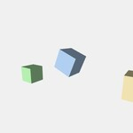](https://github.com/hamoid/Fun-Programming/blob/master/processing/ideas/2012/04/walking_cube/)  animation, camera | [living Blob ](https://github.com/hamoid/Fun-Programming/blob/master/processing/ideas/2012/05/livingBlob/)  animation, texture | [dragworld ](https://github.com/hamoid/Fun-Programming/blob/master/processing/ideas/2012/06/dragworld/)  interactive | [Arduino178Children ](https://github.com/hamoid/Fun-Programming/blob/master/processing/ideas/2013/01/Arduino178Children/)  arduino  |
| [BWJoy ](https://github.com/hamoid/Fun-Programming/blob/master/processing/ideas/2013/02/BWJoy/)  animation | [Barycentric Triangle Mapping ](https://github.com/hamoid/Fun-Programming/blob/master/processing/ideas/2013/02/BarycentricTriangleMapping/)  geometry | [Color Joy ](https://github.com/hamoid/Fun-Programming/blob/master/processing/ideas/2013/02/ColorJoy/)  animation | [Melt Writer ](https://github.com/hamoid/Fun-Programming/blob/master/processing/ideas/2013/02/MeltWriter/)  interactive, paint | [Rotation Continuity 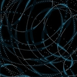](https://github.com/hamoid/Fun-Programming/blob/master/processing/ideas/2013/02/RotationContinuity/)   |
| [words To Shapes ](https://github.com/hamoid/Fun-Programming/blob/master/processing/ideas/2013/06/wordsToShapes/)  interactive, line | [upload Image ](https://github.com/hamoid/Fun-Programming/blob/master/processing/ideas/2013/07/uploadImage/)  php | [Change Var By Name](https://github.com/hamoid/Fun-Programming/blob/master/processing/ideas/2013/08/ChangeVarByName/)  reflection | [p5tweets ](https://github.com/hamoid/Fun-Programming/blob/master/processing/ideas/2013/08/p5tweets/)  challenge | [gif Anim One ](https://github.com/hamoid/Fun-Programming/blob/master/processing/ideas/2013/10/gifAnimOne/)  loop  |
| [anim Gif Mountains ](https://github.com/hamoid/Fun-Programming/blob/master/processing/ideas/2013/11/animGifMountains/)  loop | [fade With Shader ](https://github.com/hamoid/Fun-Programming/blob/master/processing/ideas/2013/11/fadeWithShader/)  shader | [image Distorts Image ](https://github.com/hamoid/Fun-Programming/blob/master/processing/ideas/2013/11/imageDistortsImage/)  interactive, paint | [client](https://github.com/hamoid/Fun-Programming/blob/master/processing/ideas/2013/11/prettyDecentDisplay/client/)  | [server](https://github.com/hamoid/Fun-Programming/blob/master/processing/ideas/2013/11/prettyDecentDisplay/server/)   |
| [stm ](https://github.com/hamoid/Fun-Programming/blob/master/processing/ideas/2013/11/stm/)  dataviz | [gears ](https://github.com/hamoid/Fun-Programming/blob/master/processing/ideas/2013/12/gears/)  loop | [happyeoy ](https://github.com/hamoid/Fun-Programming/blob/master/processing/ideas/2013/12/happyeoy/)  loop | [sine Bass Sequence](https://github.com/hamoid/Fun-Programming/blob/master/processing/ideas/2013/12/sineBassSequence/)  | [sine Bass Sequence](https://github.com/hamoid/Fun-Programming/blob/master/processing/ideas/2013/12/sineBassSequence/)   |
| [sparkling Text ](https://github.com/hamoid/Fun-Programming/blob/master/processing/ideas/2013/12/sparklingText/)  loop, particles | [text Randomizer ](https://github.com/hamoid/Fun-Programming/blob/master/processing/ideas/2013/12/textRandomizer/)  | [avoid ](https://github.com/hamoid/Fun-Programming/blob/master/processing/ideas/2014/01/avoid/)  animation, line | [drawing With Undo Redo ](https://github.com/hamoid/Fun-Programming/blob/master/processing/ideas/2014/01/drawingWithUndoRedo/)  interactive | [undo ](https://github.com/hamoid/Fun-Programming/blob/master/processing/ideas/2014/01/undo/)  interactive  |
| [text Cloud Rotating ](https://github.com/hamoid/Fun-Programming/blob/master/processing/ideas/2014/02/textCloudRotating/)  animation | [voronoi ](https://github.com/hamoid/Fun-Programming/blob/master/processing/ideas/2014/02/voronoi/)  trails | [long Gif Anim Loop ](https://github.com/hamoid/Fun-Programming/blob/master/processing/ideas/2014/03/longGifAnimLoop/)  loop | [lossy jpg ](https://github.com/hamoid/Fun-Programming/blob/master/processing/ideas/2014/03/lossy_jpg/)  test | [revolving ](https://github.com/hamoid/Fun-Programming/blob/master/processing/ideas/2014/03/revolving/)  depth, loop  |
| [noise Add ](https://github.com/hamoid/Fun-Programming/blob/master/processing/ideas/2014/04/noiseAdd/)  | [rings Cleaner ](https://github.com/hamoid/Fun-Programming/blob/master/processing/ideas/2014/04/ringsCleaner/)  depth | [rings Shadow ](https://github.com/hamoid/Fun-Programming/blob/master/processing/ideas/2014/04/ringsShadow/)  depth | [rings Which Is Closer ](https://github.com/hamoid/Fun-Programming/blob/master/processing/ideas/2014/04/ringsWhichIsCloser/)  depth | [tank Wheels ](https://github.com/hamoid/Fun-Programming/blob/master/processing/ideas/2014/04/tankWheels/)  loop  |
| [Terrain ](https://github.com/hamoid/Fun-Programming/blob/master/processing/ideas/2014/05/Terrain/)  | [rings Blend Mode ](https://github.com/hamoid/Fun-Programming/blob/master/processing/ideas/2014/05/ringsBlendMode/)  depth | [two Diff Reactions To OSCmsgs](https://github.com/hamoid/Fun-Programming/blob/master/processing/ideas/2014/05/twoDiffReactionsToOSCmsgs/)  | [pshape Vs Toxic ](https://github.com/hamoid/Fun-Programming/blob/master/processing/ideas/2014/06/pshapeVsToxic/)  test, performance | [avoid garbage collection](https://github.com/hamoid/Fun-Programming/blob/master/processing/ideas/2014/08/avoid_garbage_collection/)  test  |
| [erase Black Pixels ](https://github.com/hamoid/Fun-Programming/blob/master/processing/ideas/2014/09/eraseBlackPixels/)  test | [erase Black Pixels Lookup ](https://github.com/hamoid/Fun-Programming/blob/master/processing/ideas/2014/09/eraseBlackPixelsLookup/)  test | [key Pressed Var Vs Func](https://github.com/hamoid/Fun-Programming/blob/master/processing/ideas/2014/10/keyPressedVarVsFunc/)  test | [oral Description Error ](https://github.com/hamoid/Fun-Programming/blob/master/processing/ideas/2014/10/oralDescriptionError/)  | [oral Description Game ](https://github.com/hamoid/Fun-Programming/blob/master/processing/ideas/2014/10/oralDescriptionGame/)  line, loop  |
| [loop Of Random Items ](https://github.com/hamoid/Fun-Programming/blob/master/processing/ideas/2014/11/loopOfRandomItems/)  loop | [thousand Rects ](https://github.com/hamoid/Fun-Programming/blob/master/processing/ideas/2014/11/thousandRects/)  trails | [boxes Are Light ](https://github.com/hamoid/Fun-Programming/blob/master/processing/ideas/2015/01/boxesAreLight/)  | [recursive Boxes ](https://github.com/hamoid/Fun-Programming/blob/master/processing/ideas/2015/01/recursiveBoxes/)  recursive | [stream To FFMPEG](https://github.com/hamoid/Fun-Programming/blob/master/processing/ideas/2015/01/streamToFFMPEG/)   |
| [CCGame Iterate001 ](https://github.com/hamoid/Fun-Programming/blob/master/processing/ideas/2015/02/CCGame_Iterate001/)  | [scan Line Flood 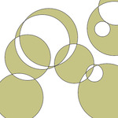](https://github.com/hamoid/Fun-Programming/blob/master/processing/ideas/2015/02/scanLineFlood/)  interactive, test | [gradient ](https://github.com/hamoid/Fun-Programming/blob/master/processing/ideas/2015/03/gradient/)  | [gradient Polygon ](https://github.com/hamoid/Fun-Programming/blob/master/processing/ideas/2015/03/gradientPolygon/)  texture | [ellipso rect 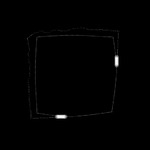](https://github.com/hamoid/Fun-Programming/blob/master/processing/ideas/2015/06/ellipso_rect/)  animation, loop, particles  |
| [grid of combinations 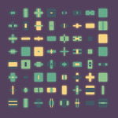](https://github.com/hamoid/Fun-Programming/blob/master/processing/ideas/2015/06/grid_of_combinations/)  grid | [grid of combinations rot 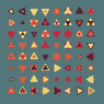](https://github.com/hamoid/Fun-Programming/blob/master/processing/ideas/2015/06/grid_of_combinations_rot/)  grid | [impossiboligon 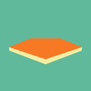](https://github.com/hamoid/Fun-Programming/blob/master/processing/ideas/2015/06/impossiboligon/)  loop | [lacuna Noise Logo ](https://github.com/hamoid/Fun-Programming/blob/master/processing/ideas/2015/06/lacunaNoiseLogo/)  animation | [recursive Tree 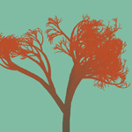](https://github.com/hamoid/Fun-Programming/blob/master/processing/ideas/2015/06/recursiveTree/)  loop, recursive  |
| [recursive lines 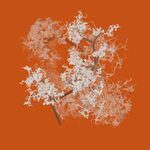](https://github.com/hamoid/Fun-Programming/blob/master/processing/ideas/2015/06/recursive_lines/)  recursive | [the Look Of Noise ](https://github.com/hamoid/Fun-Programming/blob/master/processing/ideas/2015/06/theLookOfNoise/)  animation, noise | [the Look Of Noise Flat ](https://github.com/hamoid/Fun-Programming/blob/master/processing/ideas/2015/06/theLookOfNoiseFlat/)  animation | [we ](https://github.com/hamoid/Fun-Programming/blob/master/processing/ideas/2015/06/we/)  grid | [noise Contours ](https://github.com/hamoid/Fun-Programming/blob/master/processing/ideas/2015/09/noiseContours/)  noise, opencv  |
| [noise Dir Quantized ](https://github.com/hamoid/Fun-Programming/blob/master/processing/ideas/2015/09/noiseDirQuantized/)  line | [radial hex ](https://github.com/hamoid/Fun-Programming/blob/master/processing/ideas/2015/09/radial_hex/)  interactive, line | [particles Noise ](https://github.com/hamoid/Fun-Programming/blob/master/processing/ideas/2015/12/particlesNoise/)  flocking, line, natureofcode, trails | [caustic ](https://github.com/hamoid/Fun-Programming/blob/master/processing/ideas/2016/02/caustic/)  static, refraction, light | [Lewitt Drawing](https://github.com/hamoid/Fun-Programming/blob/master/processing/ideas/2016/05/LewittDrawing/)   |
| [Lewitt Drawing Server](https://github.com/hamoid/Fun-Programming/blob/master/processing/ideas/2016/05/LewittDrawingServer/)  | [non overlapping circles using arrays ](https://github.com/hamoid/Fun-Programming/blob/master/processing/ideas/2016/07/non_overlapping_circles_using_arrays/)  | [pipe Process Input ](https://github.com/hamoid/Fun-Programming/blob/master/processing/ideas/2016/07/pipeProcessInput/)  viz | [copycat ](https://github.com/hamoid/Fun-Programming/blob/master/processing/ideas/2017/01/copycat/)  | [Midi Viz ](https://github.com/hamoid/Fun-Programming/blob/master/processing/ideas/2017/04/MidiViz/)  midi, shader, viz  |
| [extract Audio With Ffmpeg ](https://github.com/hamoid/Fun-Programming/blob/master/processing/ideas/2017/05/extractAudioWithFfmpeg/)  | [hsluv ](https://github.com/hamoid/Fun-Programming/blob/master/processing/ideas/2017/05/hsluv/)  color | [plot3Dfor Jerome ](https://github.com/hamoid/Fun-Programming/blob/master/processing/ideas/2017/05/plot3DforJerome/)  static | [plot3Dorganic ](https://github.com/hamoid/Fun-Programming/blob/master/processing/ideas/2017/05/plot3Dorganic/)  static | [lineshader ](https://github.com/hamoid/Fun-Programming/blob/master/processing/ideas/2017/08/lineshader/)  line, shader  |
| [lineshader2 ](https://github.com/hamoid/Fun-Programming/blob/master/processing/ideas/2017/08/lineshader2/)  animation, line, shader | [shaded ](https://github.com/hamoid/Fun-Programming/blob/master/processing/ideas/2017/08/shaded/)  shader | [copycat gears ](https://github.com/hamoid/Fun-Programming/blob/master/processing/ideas/2017/10/copycat_gears/)  loop | [avoidxmas ](https://github.com/hamoid/Fun-Programming/blob/master/processing/ideas/2017/12/avoidxmas/)  animation, line | [shader Breaks Sphere ](https://github.com/hamoid/Fun-Programming/blob/master/processing/ideas/2018/02/shaderBreaksSphere/)  shader  |
| [shader Scroll Textured ](https://github.com/hamoid/Fun-Programming/blob/master/processing/ideas/2018/02/shaderScrollTextured/)  shader, video, mask | [shader Shadow2 svg ](https://github.com/hamoid/Fun-Programming/blob/master/processing/ideas/2018/02/shaderShadow2_svg/)  shader | [fft Frag Shader ](https://github.com/hamoid/Fun-Programming/blob/master/processing/ideas/2018/03/fftFragShader/)  shader, fft | [fft Vert Shader ](https://github.com/hamoid/Fun-Programming/blob/master/processing/ideas/2018/03/fftVertShader/)  shader | [matrix Multiplication ](https://github.com/hamoid/Fun-Programming/blob/master/processing/ideas/2018/03/matrixMultiplication/)  viz  |
| [viz Img Color Distrib ](https://github.com/hamoid/Fun-Programming/blob/master/processing/ideas/2018/03/vizImgColorDistrib/)  color | [orthocubes ](https://github.com/hamoid/Fun-Programming/blob/master/processing/ideas/2018/04/orthocubes/)  shader | [pan Zoom Sketch ](https://github.com/hamoid/Fun-Programming/blob/master/processing/ideas/2018/08/panZoomSketch/)  interactive | [pixelate Shader ](https://github.com/hamoid/Fun-Programming/blob/master/processing/ideas/2018/08/pixelateShader/)  shader | [rot Cube Gradient ](https://github.com/hamoid/Fun-Programming/blob/master/processing/ideas/2018/09/rotCubeGradient/)  trails  |
| [copycat Split Triangle ](https://github.com/hamoid/Fun-Programming/blob/master/processing/ideas/2018/10/copycatSplitTriangle/)  animation, loop | [measure Dropped Frames ](https://github.com/hamoid/Fun-Programming/blob/master/processing/ideas/2018/10/measureDroppedFrames/)  animation, test, fps | [spinning Cube Rainbow ](https://github.com/hamoid/Fun-Programming/blob/master/processing/ideas/2018/10/spinningCubeRainbow/)  trails | [transparency Test PShape ](https://github.com/hamoid/Fun-Programming/blob/master/processing/ideas/2018/10/transparencyTestPShape/)  interactive, transparency, hint, test | [Envelope Grid Test ](https://github.com/hamoid/Fun-Programming/blob/master/processing/ideas/2018/11/EnvelopeGridTest/)  animation  |
| [Flowers ](https://github.com/hamoid/Fun-Programming/blob/master/processing/ideas/2018/11/Flowers/)  animation | [line Normals ](https://github.com/hamoid/Fun-Programming/blob/master/processing/ideas/2018/11/lineNormals/)  geometry, line, normals, pshape, pvector | [ping Pong Shader 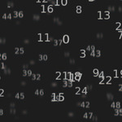](https://github.com/hamoid/Fun-Programming/blob/master/processing/ideas/2018/11/pingPongShader/)  animation, shader | [bidirectional Perlin Noise ](https://github.com/hamoid/Fun-Programming/blob/master/processing/ideas/2019/01/bidirectionalPerlinNoise/)  test | [bump In Circle ](https://github.com/hamoid/Fun-Programming/blob/master/processing/ideas/2019/01/bumpInCircle/)  animation  |
| [click To Erase ](https://github.com/hamoid/Fun-Programming/blob/master/processing/ideas/2019/01/clickToErase/)  blend, gamma, interactive, trails | [circular Gradients ](https://github.com/hamoid/Fun-Programming/blob/master/processing/ideas/2019/04/circularGradients/)  shader | [following2D ](https://github.com/hamoid/Fun-Programming/blob/master/processing/ideas/2019/04/following2D/)  animation, physics, target | [gradient With Vertex ](https://github.com/hamoid/Fun-Programming/blob/master/processing/ideas/2019/04/gradientWithVertex/)  static, gradient, grid, margin | [variable Thickness Lines ](https://github.com/hamoid/Fun-Programming/blob/master/processing/ideas/2019/04/variableThicknessLines/)  line, shader  |
| [Thick Line Test ](https://github.com/hamoid/Fun-Programming/blob/master/processing/ideas/2019/06/ThickLineTest/)  pshape, line, static, obj | [crosses ](https://github.com/hamoid/Fun-Programming/blob/master/processing/ideas/2019/06/crosses/)  static | [Shader Texture Cube ](https://github.com/hamoid/Fun-Programming/blob/master/processing/ideas/2019/08/ShaderTextureCube/)  shader | [bezier similarity ](https://github.com/hamoid/Fun-Programming/blob/master/processing/ideas/2019/09/bezier_similarity/)  line, bezier, interactive | [sin rainbow ](https://github.com/hamoid/Fun-Programming/blob/master/processing/ideas/2019/09/sin_rainbow/)  color  |
| [draw Donut ](https://github.com/hamoid/Fun-Programming/blob/master/processing/ideas/2019/11/drawDonut/)  pshape | [layer3D ](https://github.com/hamoid/Fun-Programming/blob/master/processing/ideas/2019/11/layer3D/)  pgraphics | [forum call method by name ](https://github.com/hamoid/Fun-Programming/blob/master/processing/ideas/2020/01/forum_call_method_by_name/)  reflection | [irregular Line Between Two Points ](https://github.com/hamoid/Fun-Programming/blob/master/processing/ideas/2020/03/irregularLineBetweenTwoPoints/)  geometry, line | [line Segment Circle Intersection 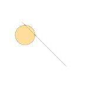](https://github.com/hamoid/Fun-Programming/blob/master/processing/ideas/2020/05/lineSegmentCircleIntersection/)  line, geometry, circle, intersection, interactive  |
