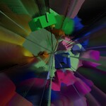
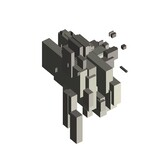
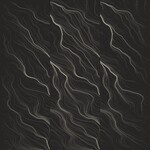

# Fun Programming

In this repository you can find:

- Programs written for the [Fun Programming](https://funprogramming.org) video
  tutorials: [fun-programming](https://github.com/hamoid/Fun-Programming/tree/master/processing/fun-programming)
- My creative coding experiments: [processing/ideas](https://github.com/hamoid/Fun-Programming/tree/master/processing/ideas).
  These are not finished work but tests I do while developing a project or experiments done just for fun and out of curiosity.
  Index below. You can view some results at https://hamoid.com and at http://hamoid.tumblr.com/archive

Most programs here are written using [Processing](http://www.processing.org/).
Some with [SuperCollider](https://supercollider.github.io/).
They are great for creating static / animated / interactive graphics and sound synthesis.

My current tools include [OPENRNDR](https://openrndr.org) and GLSL.

### Roadmap

- [x] Create thumbnails
- [x] Create a visual index
- [ ] Add tags to each sketch
- [ ] Upload my sketches, one per day. I should be done in 2020.
- [ ] Write a readme.md for each
 
| . | . | . | . | . |
| --- | --- | --- | --- | --- |
| [uhmans ](https://github.com/hamoid/Fun-Programming/blob/master/processing/ideas/2006/04/uhmans/) | [bezier Fish ](https://github.com/hamoid/Fun-Programming/blob/master/processing/ideas/2011/05/bezierFish/) | [noise line ](https://github.com/hamoid/Fun-Programming/blob/master/processing/ideas/2011/08/noise_line/) | [translate rotate ](https://github.com/hamoid/Fun-Programming/blob/master/processing/ideas/2011/08/translate_rotate/) | [noise is centered ](https://github.com/hamoid/Fun-Programming/blob/master/processing/ideas/2011/09/noise_is_centered/)  |
| [sine acid ](https://github.com/hamoid/Fun-Programming/blob/master/processing/ideas/2011/09/sine_acid/) | [sine rainbow ](https://github.com/hamoid/Fun-Programming/blob/master/processing/ideas/2011/09/sine_rainbow/) | [inf bezier ](https://github.com/hamoid/Fun-Programming/blob/master/processing/ideas/2012/02/inf_bezier/) | [dragworld ](https://github.com/hamoid/Fun-Programming/blob/master/processing/ideas/2012/06/dragworld/) | [Arduino178Children ](https://github.com/hamoid/Fun-Programming/blob/master/processing/ideas/2013/01/Arduino178Children/)  |
| [Barycentric Triangle Mapping ](https://github.com/hamoid/Fun-Programming/blob/master/processing/ideas/2013/02/BarycentricTriangleMapping/) | [Color Joy ](https://github.com/hamoid/Fun-Programming/blob/master/processing/ideas/2013/02/ColorJoy/) | [Melt Writer ](https://github.com/hamoid/Fun-Programming/blob/master/processing/ideas/2013/02/MeltWriter/) | [words To Shapes ](https://github.com/hamoid/Fun-Programming/blob/master/processing/ideas/2013/06/wordsToShapes/) | [upload Image ](https://github.com/hamoid/Fun-Programming/blob/master/processing/ideas/2013/07/uploadImage/)  |
| [Change Var By Name](https://github.com/hamoid/Fun-Programming/blob/master/processing/ideas/2013/08/ChangeVarByName/) | [p5tweets ](https://github.com/hamoid/Fun-Programming/blob/master/processing/ideas/2013/08/p5tweets/) | [gif Anim One ](https://github.com/hamoid/Fun-Programming/blob/master/processing/ideas/2013/10/gifAnimOne/) | [anim Gif Mountains ](https://github.com/hamoid/Fun-Programming/blob/master/processing/ideas/2013/11/animGifMountains/) | [fade With Shader ](https://github.com/hamoid/Fun-Programming/blob/master/processing/ideas/2013/11/fadeWithShader/)  |
| [image Distorts Image ](https://github.com/hamoid/Fun-Programming/blob/master/processing/ideas/2013/11/imageDistortsImage/) | [client](https://github.com/hamoid/Fun-Programming/blob/master/processing/ideas/2013/11/prettyDecentDisplay/client/) | [server](https://github.com/hamoid/Fun-Programming/blob/master/processing/ideas/2013/11/prettyDecentDisplay/server/) | [stm ](https://github.com/hamoid/Fun-Programming/blob/master/processing/ideas/2013/11/stm/) | [gears ](https://github.com/hamoid/Fun-Programming/blob/master/processing/ideas/2013/12/gears/)  |
| [happyeoy ](https://github.com/hamoid/Fun-Programming/blob/master/processing/ideas/2013/12/happyeoy/) | [sine Bass Sequence](https://github.com/hamoid/Fun-Programming/blob/master/processing/ideas/2013/12/sineBassSequence/) | [sine Bass Sequence](https://github.com/hamoid/Fun-Programming/blob/master/processing/ideas/2013/12/sineBassSequence/) | [sparkling Text ](https://github.com/hamoid/Fun-Programming/blob/master/processing/ideas/2013/12/sparklingText/) | [text Randomizer ](https://github.com/hamoid/Fun-Programming/blob/master/processing/ideas/2013/12/textRandomizer/)  |
| [avoid ](https://github.com/hamoid/Fun-Programming/blob/master/processing/ideas/2014/01/avoid/) | [drawing With Undo Redo ](https://github.com/hamoid/Fun-Programming/blob/master/processing/ideas/2014/01/drawingWithUndoRedo/) | [undo ](https://github.com/hamoid/Fun-Programming/blob/master/processing/ideas/2014/01/undo/) | [text Cloud Rotating ](https://github.com/hamoid/Fun-Programming/blob/master/processing/ideas/2014/02/textCloudRotating/) | [voronoi ](https://github.com/hamoid/Fun-Programming/blob/master/processing/ideas/2014/02/voronoi/)  |
| [long Gif Anim Loop ](https://github.com/hamoid/Fun-Programming/blob/master/processing/ideas/2014/03/longGifAnimLoop/) | [lossy jpg ](https://github.com/hamoid/Fun-Programming/blob/master/processing/ideas/2014/03/lossy_jpg/) | [revolving ](https://github.com/hamoid/Fun-Programming/blob/master/processing/ideas/2014/03/revolving/) | [noise Add ](https://github.com/hamoid/Fun-Programming/blob/master/processing/ideas/2014/04/noiseAdd/) | [rings Cleaner ](https://github.com/hamoid/Fun-Programming/blob/master/processing/ideas/2014/04/ringsCleaner/)  |
| [rings Shadow ](https://github.com/hamoid/Fun-Programming/blob/master/processing/ideas/2014/04/ringsShadow/) | [rings Which Is Closer ](https://github.com/hamoid/Fun-Programming/blob/master/processing/ideas/2014/04/ringsWhichIsCloser/) | [tank Wheels ](https://github.com/hamoid/Fun-Programming/blob/master/processing/ideas/2014/04/tankWheels/) | [Terrain ](https://github.com/hamoid/Fun-Programming/blob/master/processing/ideas/2014/05/Terrain/) | [rings Blend Mode ](https://github.com/hamoid/Fun-Programming/blob/master/processing/ideas/2014/05/ringsBlendMode/)  |
| [two Diff Reactions To OSCmsgs](https://github.com/hamoid/Fun-Programming/blob/master/processing/ideas/2014/05/twoDiffReactionsToOSCmsgs/) | [pshape Vs Toxic ](https://github.com/hamoid/Fun-Programming/blob/master/processing/ideas/2014/06/pshapeVsToxic/) | [avoid garbage collection](https://github.com/hamoid/Fun-Programming/blob/master/processing/ideas/2014/08/avoid_garbage_collection/) | [erase Black Pixels ](https://github.com/hamoid/Fun-Programming/blob/master/processing/ideas/2014/09/eraseBlackPixels/) | [erase Black Pixels Lookup ](https://github.com/hamoid/Fun-Programming/blob/master/processing/ideas/2014/09/eraseBlackPixelsLookup/)  |
| [key Pressed Var Vs Func](https://github.com/hamoid/Fun-Programming/blob/master/processing/ideas/2014/10/keyPressedVarVsFunc/) | [oral Description Error ](https://github.com/hamoid/Fun-Programming/blob/master/processing/ideas/2014/10/oralDescriptionError/) | [oral Description Game ](https://github.com/hamoid/Fun-Programming/blob/master/processing/ideas/2014/10/oralDescriptionGame/) | [loop Of Random Items ](https://github.com/hamoid/Fun-Programming/blob/master/processing/ideas/2014/11/loopOfRandomItems/) | [thousand Rects ](https://github.com/hamoid/Fun-Programming/blob/master/processing/ideas/2014/11/thousandRects/)  |
| [boxes Are Light ](https://github.com/hamoid/Fun-Programming/blob/master/processing/ideas/2015/01/boxesAreLight/) | [recursive Boxes ](https://github.com/hamoid/Fun-Programming/blob/master/processing/ideas/2015/01/recursiveBoxes/) | [stream To FFMPEG](https://github.com/hamoid/Fun-Programming/blob/master/processing/ideas/2015/01/streamToFFMPEG/) | [CCGame Iterate001 ](https://github.com/hamoid/Fun-Programming/blob/master/processing/ideas/2015/02/CCGame_Iterate001/) | [gradient ](https://github.com/hamoid/Fun-Programming/blob/master/processing/ideas/2015/03/gradient/)  |
| [gradient Polygon ](https://github.com/hamoid/Fun-Programming/blob/master/processing/ideas/2015/03/gradientPolygon/) | [noise Contours ](https://github.com/hamoid/Fun-Programming/blob/master/processing/ideas/2015/09/noiseContours/) | [noise Dir Quantized ](https://github.com/hamoid/Fun-Programming/blob/master/processing/ideas/2015/09/noiseDirQuantized/) | [radial hex ](https://github.com/hamoid/Fun-Programming/blob/master/processing/ideas/2015/09/radial_hex/) | [caustic ](https://github.com/hamoid/Fun-Programming/blob/master/processing/ideas/2016/02/caustic/)  |
| [Lewitt Drawing](https://github.com/hamoid/Fun-Programming/blob/master/processing/ideas/2016/05/LewittDrawing/) | [Lewitt Drawing Server](https://github.com/hamoid/Fun-Programming/blob/master/processing/ideas/2016/05/LewittDrawingServer/) | [non overlapping circles using arrays ](https://github.com/hamoid/Fun-Programming/blob/master/processing/ideas/2016/07/non_overlapping_circles_using_arrays/) | [pipe Process Input ](https://github.com/hamoid/Fun-Programming/blob/master/processing/ideas/2016/07/pipeProcessInput/) | [copycat ](https://github.com/hamoid/Fun-Programming/blob/master/processing/ideas/2017/01/copycat/)  |
| [Midi Viz ](https://github.com/hamoid/Fun-Programming/blob/master/processing/ideas/2017/04/MidiViz/) | [extract Audio With Ffmpeg ](https://github.com/hamoid/Fun-Programming/blob/master/processing/ideas/2017/05/extractAudioWithFfmpeg/) | [hsluv ](https://github.com/hamoid/Fun-Programming/blob/master/processing/ideas/2017/05/hsluv/) | [plot3Dfor Jerome ](https://github.com/hamoid/Fun-Programming/blob/master/processing/ideas/2017/05/plot3DforJerome/) | [plot3Dorganic ](https://github.com/hamoid/Fun-Programming/blob/master/processing/ideas/2017/05/plot3Dorganic/)  |
| [lineshader ](https://github.com/hamoid/Fun-Programming/blob/master/processing/ideas/2017/08/lineshader/) | [lineshader2 ](https://github.com/hamoid/Fun-Programming/blob/master/processing/ideas/2017/08/lineshader2/) | [shaded ](https://github.com/hamoid/Fun-Programming/blob/master/processing/ideas/2017/08/shaded/) | [copycat gears ](https://github.com/hamoid/Fun-Programming/blob/master/processing/ideas/2017/10/copycat_gears/) | [avoidxmas ](https://github.com/hamoid/Fun-Programming/blob/master/processing/ideas/2017/12/avoidxmas/)  |
| [fft Frag Shader ](https://github.com/hamoid/Fun-Programming/blob/master/processing/ideas/2018/03/fftFragShader/) | [fft Vert Shader ](https://github.com/hamoid/Fun-Programming/blob/master/processing/ideas/2018/03/fftVertShader/) | [matrix Multiplication ](https://github.com/hamoid/Fun-Programming/blob/master/processing/ideas/2018/03/matrixMultiplication/) | [viz Img Color Distrib ](https://github.com/hamoid/Fun-Programming/blob/master/processing/ideas/2018/03/vizImgColorDistrib/) | [orthocubes ](https://github.com/hamoid/Fun-Programming/blob/master/processing/ideas/2018/04/orthocubes/)  |
| [pan Zoom Sketch ](https://github.com/hamoid/Fun-Programming/blob/master/processing/ideas/2018/08/panZoomSketch/) | [pixelate Shader ](https://github.com/hamoid/Fun-Programming/blob/master/processing/ideas/2018/08/pixelateShader/) | [rot Cube Gradient ](https://github.com/hamoid/Fun-Programming/blob/master/processing/ideas/2018/09/rotCubeGradient/) | [copycat Split Triangle ](https://github.com/hamoid/Fun-Programming/blob/master/processing/ideas/2018/10/copycatSplitTriangle/) | [spinning Cube Rainbow ](https://github.com/hamoid/Fun-Programming/blob/master/processing/ideas/2018/10/spinningCubeRainbow/)  |
| [Envelope Grid Test ](https://github.com/hamoid/Fun-Programming/blob/master/processing/ideas/2018/11/EnvelopeGridTest/) | [Flowers ](https://github.com/hamoid/Fun-Programming/blob/master/processing/ideas/2018/11/Flowers/) | [bidirectional Perlin Noise ](https://github.com/hamoid/Fun-Programming/blob/master/processing/ideas/2019/01/bidirectionalPerlinNoise/) | [bump In Circle ](https://github.com/hamoid/Fun-Programming/blob/master/processing/ideas/2019/01/bumpInCircle/) | [click To Erase ](https://github.com/hamoid/Fun-Programming/blob/master/processing/ideas/2019/01/clickToErase/)  |
| [circular Gradients ](https://github.com/hamoid/Fun-Programming/blob/master/processing/ideas/2019/04/circularGradients/) | [variable Thickness Lines ](https://github.com/hamoid/Fun-Programming/blob/master/processing/ideas/2019/04/variableThicknessLines/) | [crosses ](https://github.com/hamoid/Fun-Programming/blob/master/processing/ideas/2019/06/crosses/) | [Shader Texture Cube ](https://github.com/hamoid/Fun-Programming/blob/master/processing/ideas/2019/08/ShaderTextureCube/) | [sin rainbow ](https://github.com/hamoid/Fun-Programming/blob/master/processing/ideas/2019/09/sin_rainbow/)  |
| [draw Donut ](https://github.com/hamoid/Fun-Programming/blob/master/processing/ideas/2019/11/drawDonut/) | [layer3D ](https://github.com/hamoid/Fun-Programming/blob/master/processing/ideas/2019/11/layer3D/) | [forum call method by name ](https://github.com/hamoid/Fun-Programming/blob/master/processing/ideas/2020/01/forum_call_method_by_name/) | [irregular Line Between Two Points ](https://github.com/hamoid/Fun-Programming/blob/master/processing/ideas/2020/03/irregularLineBetweenTwoPoints/) 